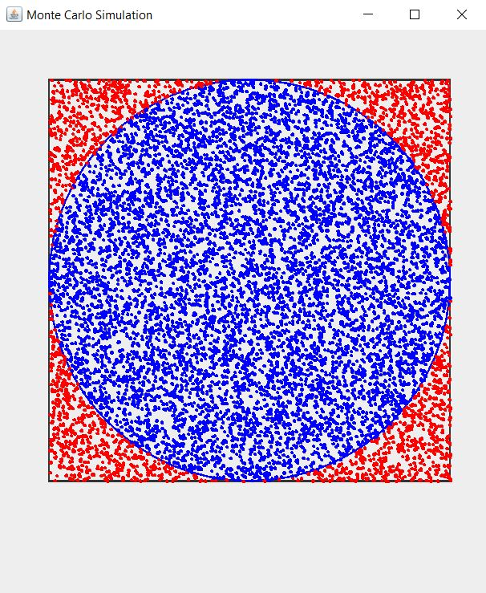

# monte-carlo

> *"Creativity is the ability to introduce order into the randomness of nature"* - Eric Hoffer

## What is this program about?
This program is about simulation using monte carlo algorithm in order to estimate $\pi$ value. Monte carlo is an algorithm to simulate stochastic events based on certain distribution and for this purpose it is just simple uniform distribution.  

*Finished state of the program*

The idea behind this program is to simulate randomized dot marking in each timestep in a space of a circle that is enclosed within a square. We count and separate the dots as follows:
- **Blue dots**: the dots that lie within the circle.
- **Red dots**: the dots that lie outside the circle and within the square.

The ratio of circle and square area will be approximated better to its true value as the number of dots gets larger. Because the same probability of dots falling in each pixel in the square, we can conclude that portion of the dots in each area correlates linearly with the area of circle and square, as follows:    

$$\large circle \textunderscore area = number \textunderscore of \textunderscore blue \textunderscore dots$$

$$\large square \textunderscore area = number \textunderscore of \textunderscore blue \textunderscore dots + number \textunderscore of \textunderscore red \textunderscore dots$$

If we take the ratio of circle and square area:

$$\begin{eqnarray}
\large\frac{circle\textunderscore area}{square\textunderscore area} &=& \frac{\pi r^2}{(2r)^2}\\
\large &=& \frac{\pi r^2}{4r^2} &=& \frac{\pi}{4}\\
\end{eqnarray}$$

where:

$$\begin{eqnarray}
\large r &=& radius \enspace of \enspace the \enspace circle\\
\large 2 \times r &=& side \enspace of \enspace the \enspace square\\
\end{eqnarray}$$

Therefore to get $\pi$ we can use this formula:

$$\begin{eqnarray}
\large\pi &=& \frac{4\times\ circle\textunderscore area}{square\textunderscore area}\\
\large &=& \frac{4\times\ number \textunderscore of \textunderscore blue \textunderscore dots}{number \textunderscore of \textunderscore blue \textunderscore dots + number \textunderscore of \textunderscore red \textunderscore dots}\\
\end{eqnarray}$$

<!--
$$\begin{array}{ccc}
x_{11} & x_{12} & x_{13}\\
x_{21} & x_{22} & x_{23}
\end{array}$$
$$f(k) = {n \choose k} p^{k} (1-p)^{n-k}$$
$$f(k) = {n \choose k} p^{k} (1-p)^{n-k}$$
\[\begin{align*}2x -12 &= 4\\@lhs(sol)@ &= @rhs(sol)@ \end{align*}\]

$$\phant
-->

## What things that I learned during the process?
- Creating graphical user interface using `java.util.swing.Frame` library.

## What to do next?
This is the project as part of learning process using Java programming language. The program is not finished yet, because there is 'freeze' effects due to the waiting time for the finished state to be displayed. In the next version I will add `event listeners` to better visualize the process of the simulation.

The simulation is relying on `java.util.Random` library. It leaves the implementation of generating the events. In the next program I will try to build the generator using some custom probability density function to simulate other stochastic events.

## Resources
$$\begin{eqnarray}
F &=& ma\\
V &=& IR
\end{eqnarray}$$

